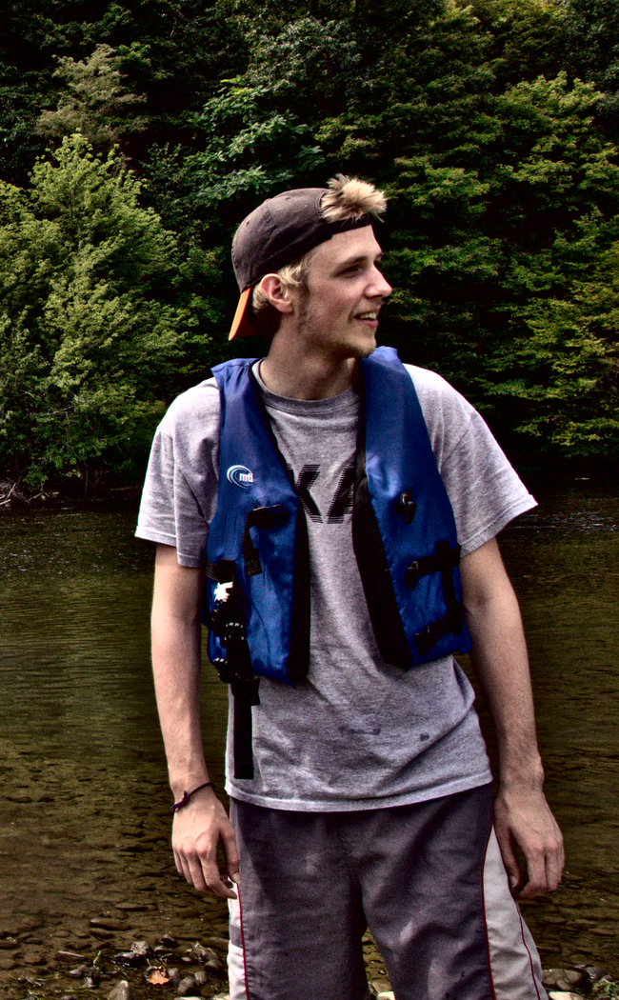

###Guðmundur Kári Stefánsson

<code>About Me</code>
 
 

Hæ! (Icelandic for hi!)

 
 

I am a Fulbright student from Iceland, currently in my first year of my PhD in Astronomy & Astrophysics at Penn State University. My primary research interest center around the study of <code>exoplanets</code>, their detection and characterization.

	When I'm not doing astrophysics (which nowadays seems mostly to consist of running/writing code, or grading papers) I like trying my luck with taking photos, especially when travelling. 
	Somewhere along the way I learned to play the guitar, and picked up a dan in Shotokan. My next immediate tasks hobby-wise are; finding a decent dojo and a good place to jam.

 

	<i>
	This blog is not an official Department of State website, and the views and information presented here are my own and do not represent the Fulbright Program or the Department of State.
	</i>

